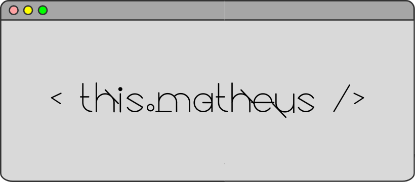

## :zombie: About me?  
> Who? Who is but the form following the function of what, and what I'm is a man in a mask.[^1]
> [^1]: V in _V for Vendetta_  

* :books: I've been studying programming since 2017
* :seedling: I’m currently learning _C#_
* :telescope: I’m interested in studyng _JavaScript_
* :mortar_board: I would like an internship. I only need this to complete the course and get the diploma.
* :brazil: Born in Black Brook, Brazil

## :hammer_and_wrench: Where do I code?  
> No! Try not. Do... or do not! There is no try.[^2]
> [^2]: Yoda in _The Empire Strikes Back_  

### :small_blue_diamond: :computer: **Asus VivoBook 15 X512FJ**  
  * **Processor**: _Intel® Core™ i5-8265U_
  * **RAM**: _8 GB_
  * **Video**:
    * _Intel® UHD Graphics_
    * _NVIDIA® GeForce® MX230_
  * **Capacity**:
    * _240 GB SSD M.2_
    * _1 TB SATA_
  * **SO**: _Windows 11 Home_

### :small_blue_diamond: :computer: **Acer Aspire A315-53**  
  * **Processor**: _Intel® Core™ i3-7020U_
  * **RAM**: _12 GB_
  * **Video**: _Intel® HD 520_
  * **Capacity**: _120 GB SSD_
  * **SO**: _Linux_ _Pop! OS 22.04 LTS_

:coffee: Buy me a coffee?

  <picture>
    
  </picture>
	
	> "People say money can’t buy happiness. They lie. Money buys coffee, coffee makes me happy!"

##    **Spotify**   
> "Music is capable of reproducing, in its real form, the pain that tears the soul and the smile that inebriates" - Ludwig van Beethoven   

_Made with_ :brain: _by_ **Carlos Matheus**
