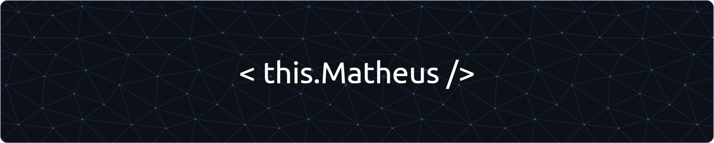

## 🧐 Hello there! 🗿🍷

Some quick notes while I'm setting this up:

* ♂️  **Pronouns**: he/him
* 🎂 **Birthday**: 29/03 (♈)
* 👍 **Like**: cats, IPA beer, streaming series, motorcycles, sleep, eat, procrastinate
* 🎓 **Graduation**: last semester of **Systems Analysis and Development**
* 📨 **How to reach me**:
  * [LinkedIn](https://www.linkedin.com/in/carlosmatheusdasilveira/)
  * [Outlook](carlos.matheus@outlook.com)
  * [Gmail](c.matheus.mobile@gmail.com)
  * [Instagram](https://www.instagram.com/carlosmatheus/)
  * [Morse Code](https://en.wikipedia.org/wiki/Morse_code)
  * [Telepathy](https://en.wikipedia.org/wiki/Telepathy)
  * [Smoke Signal](https://en.wikipedia.org/wiki/Smoke_signal)

## 🛠️  Where do I code?
💻  **Asus VivoBook 15 X512FJ**
* **Processor**: _Intel® Core™ i5-8265U_
* **RAM**: _8 GB_
* **Video**:
  * _Intel® UHD Graphics_
  * _NVIDIA® GeForce® MX230_
* **Capacity**:
	* _240 GB SSD M.2_
	* _1 TB SATA_
* **SO**: _Windows 11 Home_

 

💻  **Acer Aspire A315-53**
* **Processor**: _Intel® Core™ i3-7020U_
* **RAM**: _12 GB_
* **Video**:
  * _Intel® HD 520_
* **Capacity**: _120 GB SSD_
* **SO**: _Linux_ _Pop! OS 22.04 LTS_

---

_Made with 🌿 by **Carlos Matheus**_ | ☕ [Buy me a Coffee?](https://user-images.githubusercontent.com/59747772/220985407-8597156d-16da-4d4d-9515-0ed17a05c5d1.png)
